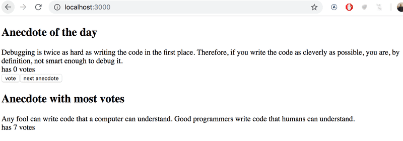

Project: Anecdote of the day and most voted anecdote
- Display random anecdote with a button click
- Create a button for voting
- Display most voted anecdote


1.12*: anecdotes step1

Expand the following application by adding a button that can be clicked to display a random anecdote from the field of software engineering:

```
import { useState } from 'react'

const App = () => {
  const anecdotes = [
    'If it hurts, do it more often',
    'Adding manpower to a late software project makes it later!',
    'The first 90 percent of the code accounts for the first 10 percent of the development time...The remaining 10 percent of the code accounts for the other 90 percent of the development time.',
    'Any fool can write code that a computer can understand. Good programmers write code that humans can understand.',
    'Premature optimization is the root of all evil.',
    'Debugging is twice as hard as writing the code in the first place. Therefore, if you write the code as cleverly as possible, you are, by definition, not smart enough to debug it.',
    'Programming without an extremely heavy use of console.log is same as if a doctor would refuse to use x-rays or blood tests when diagnosing patients'
  ]
   
  const [selected, setSelected] = useState(0)

  return (
    <div>
      {anecdotes[selected]}
    </div>
  )
}

export default App
```

1.13*: anecdotes step2

Expand your application so that you can vote for the displayed anecdote.

NB store the votes of each anecdote into an array or object in the component's state. 
Remember that the correct way of updating state stored in complex data structures like objects and arrays is to make a copy of the state.

You can create a copy of an object like this:

```
const points = { 0: 1, 1: 3, 2: 4, 3: 2 }

const copy = { ...points }
// increment the property 2 value by one
copy[2] += 1   
```
  
OR a copy of an array like this:

```
const points = [1, 4, 6, 3]

const copy = [...points]
// increment the value in position 2 by one
copy[2] += 1   
``` 
Using an array might be the simpler choice in this case.


1.14*: anecdotes step3

Now implement the final version of the application that displays the anecdote with the largest number of votes.
If multiple anecdotes are tied for first place it is sufficient to just show one of them.

