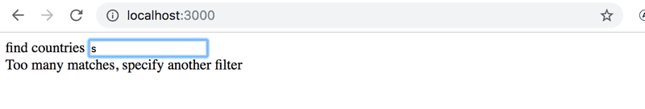
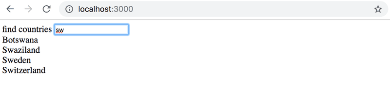
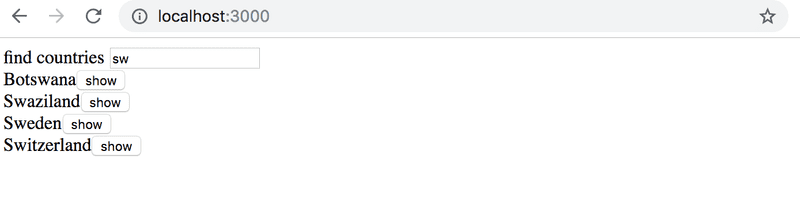
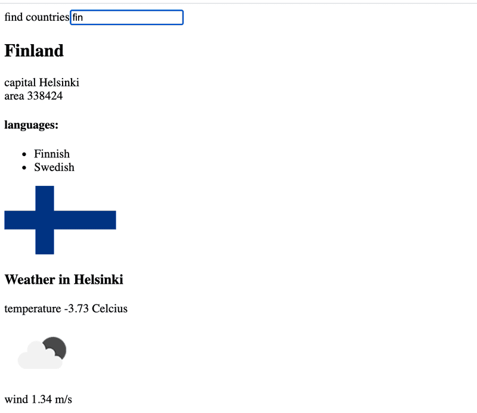

# Project: Countries

## 2.11: The Phonebook Step6

We continue with developing the phonebook. Store the initial state of the application in the file db.json, which should be placed in the root of the project.
```json
{
  "persons":[
    { 
      "name": "Arto Hellas", 
      "number": "040-123456",
      "id": 1
    },
    { 
      "name": "Ada Lovelace", 
      "number": "39-44-5323523",
      "id": 2
    },
    { 
      "name": "Dan Abramov", 
      "number": "12-43-234345",
      "id": 3
    },
    { 
      "name": "Mary Poppendieck", 
      "number": "39-23-6423122",
      "id": 4
    }
  ]
}
```

Let JSON Server to act as our server.

You can install JSON server globally on your machine using the command npm install -g json-server. A global installation requires administrative privileges, which means that it is not possible on the faculty computers or freshman laptops.

However, a global installation is not necessary. From the root directory of your app, we can run the json-server using the command npx:
```shell
npx json-server --port 3001 --watch db.json
```

The json-server starts running on port 3000 by default; but since projects created using create-react-app reserve port 3000, we must define an alternate port, such as port 3001, for the json-server.

Let's navigate to the address http://localhost:3001/notes in the browser. We can see that json-server serves the notes there.

If you receive the following error message:
```javascript
events.js:182
      throw er; // Unhandled 'error' event
      ^

Error: listen EADDRINUSE 0.0.0.0:3001
    at Object._errnoException (util.js:1019:11)
    at _exceptionWithHostPort (util.js:1041:20)
```

it means that port 3001 is already in use by another application, e.g. in use by an already running json-server. Close the other application, or change the port in case that doesn't work.

Let's make another addition. Install json-server as a development dependency (only used during development) by executing the command:
```shell
npm install json-server --save-dev
```
and making a small addition to the scripts part of the package.json file to be able to run a short bash command 'npx run server' scrip instead of 'npx json-server -p3001 --watch db.json':
```json
{
  // ... 
  "scripts": {
    // ...
    "server": "json-server -p3001 --watch db.json"
  },
}
```
We can now conveniently, without parameter definitions, start the json-server from the project root directory with the command:

```shell
npm run server
```

Modify the application such that the initial state of the data is fetched from the server using the axios-library. Don't forget to install axios library with npm:
```shell
npm install axios
```

Complete the fetching with an Effect hook.

## 2.12* Data for countries, step1

The API https://restcountries.com provides data for different countries in a machine-readable format, a so-called REST API.

Create an application, in which one can look at data of various countries. The application should probably get the data from the endpoint all.

The user interface is very simple. The country to be shown is found by typing a search query into the search field.

If there are too many (over 10) countries that match the query, then the user is prompted to make their query more specific:



If there are ten or fewer countries, but more than one, then all countries matching the query are shown:



When there is only one country matching the query, then the basic data of the country (eg. capital and area), its flag and the languages spoken there, are shown:


NB: It is enough that your application works for most of the countries. Some countries, like Sudan, can be hard to support, since the name of the country is part of the name of another country, South Sudan. You need not worry about these edge cases.

WARNING create-react-app will automatically turn your project into a git-repository unless you create your application inside of an existing git repository. Most likely you do not want each of your projects to be a separate repository, so simply run the rm -rf .git command at the root of your application.

## 2.13*: Data for countries, step2

There is still a lot to do in this part, so don't get stuck on this exercise!

Improve on the application in the previous exercise, such that when the names of multiple countries are shown on the page there is a button next to the name of the country, which when pressed shows the view for that country:



In this exercise it is also enough that your application works for most of the countries. Countries whose name appears in the name of another country, like Sudan, can be ignored.

## 2.14*: Data for countries, step3

There is still a lot to do in this part, so don't get stuck on this exercise!

Add to the view showing the data of a single country, the weather report for the capital of that country. There are dozens of providers for weather data. One suggested API is https://openweathermap.org. Note that it might take some minutes until a generated api key is valid.



If you use Open weather map, here is the description how to get weather icons.

NB: In some browsers (such as Firefox) the chosen API might send an error response, which indicates that HTTPS encryption is not supported, although the request URL starts with http://. This issue can be fixed by completing the exercise using Chrome.

NB: You need an api-key to use almost every weather service. Do not save the api-key to source control! Nor hardcode the api-key to your source code. Instead use an environment variable to save the key.

Assuming the api-key is t0p53cr3t4p1k3yv4lu3, when the application is started like so:

```shell
REACT_APP_API_KEY='t0p53cr3t4p1k3yv4lu3' npm start // For Linux/macOS Bash
($env:REACT_APP_API_KEY='t0p53cr3t4p1k3yv4lu3') -and (npm start) // For Windows PowerShell
set REACT_APP_API_KEY='t0p53cr3t4p1k3yv4lu3' && npm start // For Windows cmd.exe
```

you can access the value of the key from the process.env object:
```javascript
const api_key = process.env.REACT_APP_API_KEY
// variable api_key has now the value set in startup
```

Note that if you created the application using npx create-react-app ...and you want to use a different name for your environment variable then the environment variable name must still begin with REACT_APP_. You can also use a .envfile rather than defining it on the command line each time by creating a file entitled '.env' in the root of the project and adding the following.

```shell
# .env

REACT_APP_API_KEY=t0p53cr3t4p1k3yv4lu3
```

Note that you will need to restart the server to apply the changes.