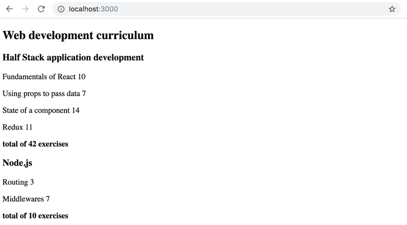

# Project: Course Info (Extended)

## 2.1: Course information step6

Let's change the App component like so:
```javascript
const App = () => {
  const course = {
    id: 1,
    name: 'Half Stack application development',
    parts: [
      {
        name: 'Fundamentals of React',
        exercises: 10,
        id: 1
      },
      {
        name: 'Using props to pass data',
        exercises: 7,
        id: 2
      },
      {
        name: 'State of a component',
        exercises: 14,
        id: 3
      }
    ]
  }

  return <Course course={course} />
}
```
Define a component responsible for formatting a single course called Course.

Hence, the Course component contains the components defined in the previous part, which are responsible for rendering the course name and its parts.

You don't need the sum of the exercises yet.

The application must work regardless of the number of parts a course has, so make sure the application works if you add or remove parts of a course.

## 2.2-2.3*: Course information step7

Calculate the sum of the exercises of the course using reduce() and display.

## 2.4: Course information step9

Let's extend our application to allow for an arbitrary number of courses:
```javascript
const App = () => {
  const courses = [
    {
      name: 'Half Stack application development',
      id: 1,
      parts: [
        {
          name: 'Fundamentals of React',
          exercises: 10,
          id: 1
        },
        {
          name: 'Using props to pass data',
          exercises: 7,
          id: 2
        },
        {
          name: 'State of a component',
          exercises: 14,
          id: 3
        },
        {
          name: 'Redux',
          exercises: 11,
          id: 4
        }
      ]
    }, 
    {
      name: 'Node.js',
      id: 2,
      parts: [
        {
          name: 'Routing',
          exercises: 3,
          id: 1
        },
        {
          name: 'Middlewares',
          exercises: 7,
          id: 2
        }
      ]
    }
  ]

  return (
    <div>
      // ...
    </div>
  )
}
```
