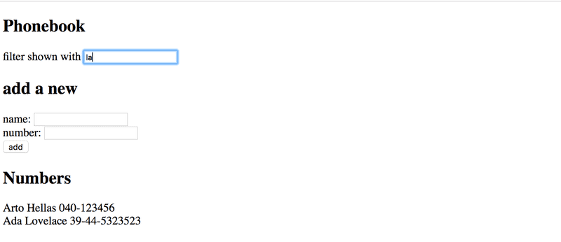

# Project: Phonebook

## 2.6: The Phonebook Step1


Let us start by implementing the addition of a person to phonebook.

You can use the code below as a starting point for the App component of your application:
```javascript
import { useState } from 'react'

const App = () => {
  const [persons, setPersons] = useState([
    { name: 'Arto Hellas' }
  ]) 
  const [newName, setNewName] = useState('')

  return (
    <div>
      <h2>Phonebook</h2>
      <form>
        <div>
          name: <input />
        </div>
        <div>
          <button type="submit">add</button>
        </div>
      </form>
      <h2>Numbers</h2>
      ...
    </div>
  )
}

export default App
```
The newName state is meant for controlling the form input element.

Sometimes it can be useful to render state and other variables as text for debugging purposes. You can temporarily add the following element to the rendered component:
```javascript
<div>debug: {newName}</div>
```


NB:

- you can use the person's name as value of the key property
- remember to prevent the default action of submitting HTML forms!

## 2.7: The Phonebook Step2

Prevent the user from being able to add names that already exist in the phonebook. JavaScript arrays have numerous suitable methods for accomplishing this task. Keep in mind how object equality works in Javascript.

Issue a warning with the alert command when such an action is attempted:


Hint: when you are forming strings that contain values from variables, it is recommended to use a template string:
```javascript
`${newName} is already added to phonebook`
```
## 2.8: The Phonebook Step3

Expand your application by allowing users to add phone numbers to the phone book. You will need to add a second input element to the form (along with its own event handler):
```javascript
<form>
  <div>name: <input /></div>
  <div>number: <input /></div>
  <div><button type="submit">add</button></div>
</form>
```


## 2.9*: The Phonebook Step4

Implement a search field that can be used to filter the list of people by name:


You can implement the search field as an input element that is placed outside the HTML form. The filtering logic shown in the image is case insensitive, meaning that the search term arto also returns results that contain Arto with an uppercase A.

## 2.10: The Phonebook Step5

If you have implemented your application in a single component, refactor it by extracting suitable parts into new components. Maintain the application's state and all event handlers in the App root component.

It is sufficient to extract three components from the application. Good candidates for separate components are, for example, the search filter, the form for adding new people into the phonebook, a component that renders all people from the phonebook, and a component that renders a single person's details.

The application's root component could look similar to this after the refactoring. The refactored root component below only renders titles and lets the extracted components take care of the rest.
```javascript
const App = () => {
  // ...

  return (
    <div>
      <h2>Phonebook</h2>

      <Filter ... />

      <h3>Add a new</h3>

      <PersonForm 
        ...
      />

      <h3>Numbers</h3>

      <Persons ... />
    </div>
  )
}
```