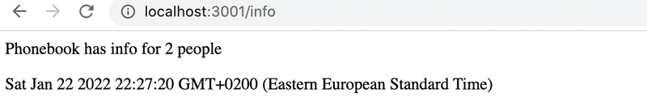

# Project: Phonebook Backend

## 2.6: The Phonebook Backend Step 0 - Installations

- Create a new template for our application with the ```npm init``` command.
- Add to 'scrips' in package.json to start the app with a short ```npm start``` command instead of ```start node index.js```.
- Install express library with ```npm install express ``` command.

All commands are executed in the root directory of the project.

Note: 

If we make changes to the application's code we have to restart the application in order to see the changes. We restart the application by first shutting it down by typing **Ctrl+C** and then restarting the application.

Installing ```nodemon``` and defining it as a development dependency will enable automatic update.

```shell
npm install --save-dev nodemon
```

To run the command  quickly, add to the scrips in package.json:
```json
{
    "dev": "nodemon index.js"
}
```
## 3.1: Phonebook backend step1

Implement a Node application that returns a hardcoded list of phonebook entries from the address http://localhost:3001/api/persons.

Data:
```js
[
{
"id": 1,
"name": "Arto Hellas",
"number": "040-123456"
},
{
"id": 2,
"name": "Ada Lovelace",
"number": "39-44-5323523"
},
{
"id": 3,
"name": "Dan Abramov",
"number": "12-43-234345"
},
{
"id": 4,
"name": "Mary Poppendieck",
"number": "39-23-6423122"
}
]
```
Notice that the forward slash in the route api/persons is not a special character, and is just like any other character in the string.

The application must be started with the command ```npm start```.

The application must also offer an ```npm run dev``` command that will run the application and restart the server whenever changes are made and saved to a file in the source code.

## 3.2: Phonebook backend step2

Implement a page at the address http://localhost:3001/info that looks roughly like this:


## 3.3: Phonebook backend step3

Implement the functionality for displaying the information for a single phonebook entry. The url for getting the data for a person with the id 5 should be http://localhost:3001/api/persons/5

If an entry for the given id is not found, the server has to respond with the appropriate status code.

## 3.4: Phonebook backend step4

Implement functionality that makes it possible to delete a single phonebook entry by making an HTTP DELETE request to the unique URL of that phonebook entry.

Test that your functionality works with either Postman or the Visual Studio Code REST client.

## 3.5: Phonebook backend step5

Expand the backend so that new phonebook entries can be added by making HTTP POST requests to the address http://localhost:3001/api/persons.

Generate a new id for the phonebook entry with the Math.random function. Use a big enough range for your random values so that the likelihood of creating duplicate ids is small.

## 3.6: Phonebook backend step6

Implement error handling for creating new entries. The request is not allowed to succeed, if:

- The name or number is missing
- The name already exists in the phonebook

Respond to requests like these with the appropriate status code, and also send back information that explains the reason for the error, e.g.: { error: 'name must be unique' }

## 3.7: Phonebook backend step7
Add the morgan middleware to your application for logging. Configure it to log messages to your console based on the tiny configuration.

Morgan is installed just like all other libraries with the ```npm install morgan``` command. Taking morgan into use happens the same way as configuring any other middleware by using the ```app.use``` command.

## 3.8*: Phonebook backend step8

Configure morgan so that it also shows the data sent in HTTP POST requests:


This exercise can be completed in a few different ways. One of the possible solutions utilizes these two techniques:

- creating new tokens
- JSON.stringify
